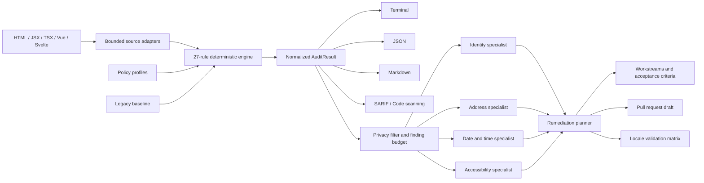

# FormKind

[](https://github.com/khanhcamap2020-sudo/formkind/actions/workflows/ci.yml)
[](https://github.com/khanhcamap2020-sudo/formkind/actions/workflows/codeql.yml)
[](package.json)
[](CHANGELOG.md)
[](LICENSE)

### The global-readiness intelligence layer for the forms the world depends on.

**Deterministic detection. Agentic remediation. Human-governed delivery.**

Forms are where global products become local failures. A checkout assumes every postal code has five digits. An identity flow rejects a mononym. An appointment silently loses its timezone. A public-service form accepts only ASCII names. Each assumption looks small in source code; together they decide who can sign up, pay, book, apply, and belong.

FormKind turns those hidden assumptions into an auditable engineering program.

It combines a privacy-first static analysis engine with an optional multi-specialist AI remediation layer. The scanner finds reproducible issues with stable rule IDs and source locations. The agent transforms those verified findings into prioritized workstreams, market checks, acceptance criteria, and pull-request-ready plans. CI keeps the standard from drifting back.

> FormKind is not merely a form linter. It is an open foundation for making digital systems legible, usable, and welcoming across languages, scripts, identities, addresses, cultures, and timezones.

## At a glance

| Capability | What FormKind provides |
| --- | --- |
| Deterministic intelligence | 27 explainable rules across seven global-readiness domains. |
| Multi-framework analysis | HTML, JSX, TSX, Vue, and Svelte, plus bounded public URL analysis. |
| Agentic remediation | Parallel domain specialists and a synthesis planner grounded in real findings. |
| Enterprise-scale adoption | Profiles, severity policy, exclusions, stable baselines, and regression-only gates. |
| Interoperable evidence | Terminal, JSON, Markdown, and SARIF for GitHub code scanning. |
| Multiple surfaces | CLI, typed JavaScript API, reusable GitHub Action, and manual AI planning workflow. |
| Privacy boundaries | Offline scans, bounded excerpts, secret redaction, no autonomous writes, human review. |
| Open governance | Apache-2.0, contribution guide, security policy, roadmap, and maintainer governance. |

## One platform, two engines

FormKind separates facts from judgment.

The **deterministic engine** owns detection. It runs locally, produces the same result for the same input, and never needs an API key. The **agentic engine** is an explicit opt-in planning layer. It cannot invent scanner findings or silently modify a repository; it can only reason over supplied findings and return a typed remediation plan.



## See the invisible failure

```text
x src/Checkout.tsx:18:7 ERROR   FK010 Postal codes use text fields
! src/Checkout.tsx:27:7 WARNING FK020 Local date-time fields provide timezone context
! src/Profile.tsx:42:5 WARNING FK004 Name inputs accept Unicode and mononyms

FormKind score: 71/100 | 2 files | 1 error | 2 warnings | 0 info
```

The scanner output is deliberately small and exact. Every finding includes:

- a stable `FK###` rule ID;
- a conservative severity;
- an exact file, line, and column;
- an actionable explanation;
- a stable fingerprint for baselines, SARIF, and agent plans;
- a category that connects the issue to the correct specialist.

The same result can become a broader delivery plan:

```text
FORMKIND AI REMEDIATION PLAN

Now   Universal address contract
      FK010 · checkout and billing
      Owners: frontend, API, QA
      Validate: CA, GB, IE, JP, AE

Next  Timezone-safe appointment flow
      FK020 · booking and confirmation
      Owners: product engineering, localization
      Validate: DST boundaries, UTC storage, locale rendering

Gate  Human review required before implementation or rollout
```

## Quick start

```bash
git clone https://github.com/khanhcamap2020-sudo/formkind.git
cd formkind
npm install
npm run build

# Scan a project with the conservative global policy.
node dist/cli.js scan ./src

# Apply a stricter policy to checkout and marketplace forms.
node dist/cli.js scan ./src --profile commerce --fail-on warning
```

After npm publication, the same workflow will be available as:

```bash
npx formkind scan ./src --profile commerce
```

## Command center

### Scan source, applications, or public pages

```bash
formkind scan ./src
formkind scan ./src ./packages/account --profile strict
formkind scan https://example.com/register --format markdown
formkind scan ./app --format sarif --output formkind.sarif
```

### Adopt FormKind without stopping delivery

Large codebases rarely fix years of global-readiness debt in one pull request. FormKind can freeze the known debt and fail CI only when a change introduces a new fingerprint.

```bash
# Capture the current state once.
formkind baseline ./legacy-app --output .formkind-baseline.json

# Enforce "no new regressions" from this point forward.
formkind scan ./legacy-app --baseline .formkind-baseline.json
```

### Initialize policy as code

```bash
formkind init --profile public-sector
formkind rules
formkind rules --format markdown --output RULES.md
```

```json
{
  "profile": "commerce",
  "exclude": ["generated/", "vendor/"],
  "ignore": ["FK008"],
  "severity": {
    "FK003": "error",
    "FK016": "off"
  }
}
```

## The AI remediation system

The agent exists for the work that begins after a linter reports a problem. A single postal-code finding may require changes to a design-system component, validation library, API schema, database constraint, analytics event, test fixture, help text, and rollout plan. FormKind's agent maps that system, while keeping the deterministic finding as its source of truth.

### Run an AI-assisted planning session

```bash
# Explicit opt-in. Normal FormKind commands never make this API call.
OPENAI_API_KEY=... formkind agent ./src \
  --profile commerce \
  --goal plan \
  --markets en-US,ar-SA,hi-IN,ja-JP \
  --max-findings 60 \
  --max-specialists 7 \
  --model gpt-5.6-terra \
  --format markdown \
  --output formkind-plan.md
```

### Run the same contract completely offline

```bash
formkind agent ./src \
  --offline \
  --goal review \
  --markets global \
  --output formkind-plan.md
```

### Agent goals

| Goal | Output emphasis |
| --- | --- |
| `assess` | User impact, risk, market checks, and unknowns. |
| `plan` | Prioritized engineering workstreams, owners, steps, and validation. |
| `review` | Reviewer concerns, regression checks, and a PR-ready summary. |

### Bounded multi-specialist orchestration

1. **Ground:** run the deterministic scanner and select only real findings.
2. **Budget:** prioritize by severity and cap findings and specialist count.
3. **Protect:** extract short source windows and redact common secrets and form values.
4. **Specialize:** analyze identity, address, contact, date/time, localization, document, and accessibility domains independently.
5. **Synthesize:** merge the typed specialist reports into one coherent delivery plan.
6. **Govern:** require a human to approve product assumptions, source changes, and rollout.

The OpenAI provider uses the Responses API with strict JSON Schema output, bounded output tokens, a request timeout, and `store: false`. The provider interface is public, so organizations can route the same orchestration through a self-hosted model, an internal gateway, or another compatible provider.

Read the complete [AI agent architecture and privacy model](docs/AI_AGENT.md).

## Global-readiness coverage

| Domain | Examples of what FormKind detects |
| --- | --- |
| Document | Missing language tags, invalid locale metadata, RTL direction failures, translation lockout. |
| Identity | ASCII-only names, required middle names or titles, missing mononym support, forced binary identity fields. |
| Address | Numeric postal fields, domestic-only patterns, mandatory regions, mandatory address line 2, truncated country lists. |
| Contact | Domestic phone masks, missing international prefixes, incorrect email or telephone semantics. |
| Date and time | Ambiguous date expectations, timezone-free local datetimes, fragile scheduling assumptions. |
| Localization | Locale-insensitive decimal inputs, measurement assumptions, non-localizable interface constraints. |
| Accessibility | Missing persistent labels, weak input semantics, and non-standard autocomplete tokens. |

Rules are intentionally conservative and explainable. They never infer a person's nationality, ethnicity, gender, disability, or legal status. Run `formkind rules --format markdown` for the live catalog.

## Policy profiles

| Profile | Designed for |
| --- | --- |
| `global` | Conservative defaults suitable for broad adoption. |
| `strict` | Teams enforcing global readiness as a release-quality gate. |
| `commerce` | Checkout, billing, shipping, delivery, and marketplace journeys. |
| `public-sector` | Identity-sensitive education, health, government, and civic services. |

Profiles alter severity, never rule meaning. This keeps findings portable between repositories, reports, baselines, and agent sessions.

## GitHub-native delivery

```yaml
name: Global readiness
on: [pull_request]

permissions:
  contents: read

jobs:
  formkind:
    runs-on: ubuntu-latest
    steps:
      - uses: actions/checkout@v7
      - uses: khanhcamap2020-sudo/formkind@main
        with:
          path: ./src
          profile: commerce
          baseline: .formkind-baseline.json
          format: sarif
          output: formkind.sarif
          fail-on: error
```

The repository also includes:

- a manual, read-only AI remediation workflow that uploads a Markdown plan artifact;
- an advisory Codex pull-request review with an explicit human gate;
- CodeQL scanning and private vulnerability reporting;
- Dependabot maintenance and reusable release infrastructure;
- SARIF output suitable for GitHub code scanning and other compatible systems.

## Typed JavaScript API

The CLI is only one surface. The normalized contracts are exported for editors, dashboards, monorepo services, review bots, internal developer portals, and future community integrations.

```js
import { analyzeHtml, report } from "formkind";

const audit = analyzeHtml(source, {
  file: "Checkout.tsx",
  config: { profile: "commerce" },
});

console.log(report(audit, "json"));
```

Agent orchestration is also public and provider-independent:

```js
import {
  OpenAIResponsesProvider,
  runRemediationAgent,
} from "formkind";

const plan = await runRemediationAgent({
  audit,
  sources,
  provider: new OpenAIResponsesProvider({
    model: "gpt-5.6-terra",
  }),
  goal: "plan",
  markets: ["en-US", "ar-SA", "hi-IN", "ja-JP"],
  maxFindings: 60,
  maxSpecialists: 7,
});
```

## Privacy is an architectural boundary

FormKind is designed for source repositories that may contain sensitive business logic.

- `scan`, `baseline`, `rules`, and `init` are local and deterministic.
- AI is disabled unless the user explicitly invokes `agent` or starts a manual workflow.
- The agent receives findings and bounded excerpts, not an unrestricted repository archive.
- Common secrets, authorization values, tokens, and form values are redacted before provider calls.
- Source excerpts are treated as untrusted data and never as agent instructions.
- Responses are requested with storage disabled by the bundled OpenAI provider.
- No provider can write files, execute source, browse, comment, commit, merge, deploy, or release through the agent contract.
- Every plan is advisory and carries a mandatory human-review flag.
- FormKind never collects personal form submissions or runtime user data.

Privacy controls reduce risk; they do not remove the maintainer's responsibility to review repository content and provider policy before enabling a remote model.

## Built to grow beyond a single repository

FormKind's architecture is deliberately modular:

- source adapters normalize frameworks without embedding parser logic in rules;
- profiles and baselines scale policy across mature codebases;
- stable fingerprints connect CLI, SARIF, agent plans, and future dashboards;
- reporters expose one result model to many delivery systems;
- `AgentProvider` makes model infrastructure replaceable;
- an offline provider keeps the workflow available without credentials;
- the planned plugin SDK will support community and industry rule packs.

The roadmap extends toward framework-native AST adapters, safe low-risk autofix, an isolated browser runner for multi-step flows, a VS Code extension, reusable locale datasets, evaluation fixtures, provider benchmarks, and a documentation portal.

Explore the [architecture](docs/ARCHITECTURE.md), [AI agent design](docs/AI_AGENT.md), [adoption guide](docs/ADOPTION.md), [rule catalog](docs/RULES.md), and [roadmap](ROADMAP.md).

## Design principles

1. **Evidence before eloquence.** AI can organize and explain findings; it cannot overrule deterministic evidence.
2. **International users are not edge cases.** Names, addresses, scripts, calendars, numbers, and identities vary by design.
3. **No cultural guessing.** FormKind detects technical constraints and asks teams to validate markets with people and evidence.
4. **Adoption must be incremental.** Baselines let large systems improve without freezing delivery.
5. **Automation must remain governable.** External calls are explicit, bounded, observable, and human-reviewed.
6. **Open infrastructure earns trust in public.** Rules, prompts, security boundaries, governance, and limitations belong in the repository.

## Limitations

FormKind currently performs static analysis and does not execute application JavaScript. Dynamic component state, server-generated constraints, cross-page journeys, and visual behavior may require the planned isolated browser runner. Agent plans may be incomplete or incorrect and cannot replace accessibility research, localization expertise, legal review, or testing with people in the markets a product serves.

FormKind is engineering guidance, not legal certification.

## Community and stewardship

FormKind aims to become shared infrastructure for a problem larger than any one framework, company, or country. Contributions are welcome across rules, adapters, fixtures, locale expertise, documentation, agent evaluation, security, and developer experience.

- Start with [CONTRIBUTING.md](CONTRIBUTING.md).
- Review project decisions in [GOVERNANCE.md](GOVERNANCE.md).
- Read the maintainer guide in [AGENTS.md](AGENTS.md).
- Report vulnerabilities through the private process in [SECURITY.md](SECURITY.md).
- Follow release history in [CHANGELOG.md](CHANGELOG.md).

FormKind is licensed under the [Apache License 2.0](LICENSE).

---

**Build forms that do not ask the world to fit into one country's database schema.**
